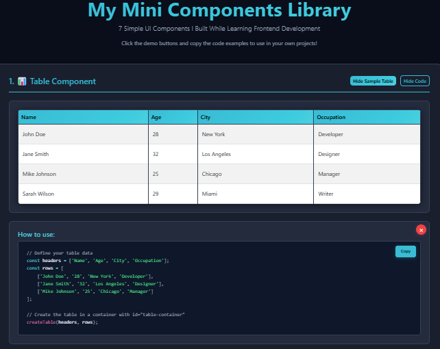

# 🧩 My Mini Components Library


Hi! This is my learning project where I built 7 simple UI components using HTML, CSS, JavaScript, and Bootstrap. I'm a beginner learning frontend development, and this project helped me understand how to create interactive web components.

## 📸 Screenshots

<div align="center">
  
  <p><em>Dark-themed component library showcasing interactive UI elements with code examples</em></p>
</div>

## 🚀 What I Built

I created 7 different components that you can use in your own projects:

### 1. 📊 Table Component
- **How to use:** `createTable(headers, rows)`
- **What it does:** Makes a nice table with data
- **What you need:** An array of column names and an array of rows
- **Cool features:** Striped rows, hover effects, works on mobile

### 2. 📝 Form Component
- **How to use:** `createForm(fields)`
- **What it does:** Creates a contact form with validation
- **What you need:** An array of field objects (like name, email, etc.)
- **Cool features:** Checks if email is valid, makes sure required fields are filled

### 3. 🪗 Accordion Component
- **How to use:** `createAccordion(items)`
- **What it does:** Makes a collapsible FAQ section
- **What you need:** An array of questions and answers
- **Cool features:** Smooth open/close animations, Bootstrap styling

### 4. 📱 Modal Popup Component
- **How to use:** `openModal(title, content)`
- **What it does:** Shows a popup window over your page
- **What you need:** A title and some content to show
- **Cool features:** Dark background overlay, easy to close

### 5. 🧭 Navbar Component
- **How to use:** `createNavbar(links)`
- **What it does:** Creates a navigation menu
- **What you need:** An array of menu items with names and links
- **Cool features:** Hamburger menu on mobile, highlights active page

### 6. 🖼️ Carousel Component
- **How to use:** `createCarousel(images)`
- **What it does:** Makes an image slideshow
- **What you need:** An array of image URLs
- **Cool features:** Next/previous buttons, dots to jump to any slide

### 7. 🚨 Alert/Toast Component
- **How to use:** `showAlert(message, type)`
- **What it does:** Shows notification messages
- **What you need:** A message and type (success, error, warning, info)
- **Cool features:** Auto-disappears after 5 seconds, different colors for different types

## 🛠️ Technologies I Used

- **HTML5** - For the basic structure of the webpage
- **CSS3** - For styling and my cool dark theme with cyan colors
- **JavaScript** - For making everything interactive (I used simple vanilla JS)
- **Bootstrap 5.3** - This made responsive design so much easier!
- **Prism.js** - For making the code examples look nice with syntax highlighting

## 🏃‍♂️ How to Try It Out

1. Download or clone this project
2. Just open `index.html` in any web browser
3. Click the demo buttons to see each component in action
4. Copy the code examples to use in your own projects

That's it! No complicated setup needed - it's all basic HTML, CSS, and JavaScript.

## 📁 Project Structure

Here's how I organized my project files:

```
mini-web-components-library-shibam/
├── 📄 index.html          # Main demo page (start here!)
├── 🎨 css/
│   └── style.css       # My custom dark theme styles
├── ⚡ js/
│   └── components.js   # All 7 component functions
├── 📸 screenshot/         # Project screenshots
│   └── mini-web-components-library-shibam.png
├── 📖 README.md           # This file - project documentation
├── 📜 LICENSE             # MIT license for the project
└── 🚫 .gitignore          # Files to ignore in version control
```

## 🛠️ Technologies Used

<table>
<tr>
<td align="center"><br><b>HTML5</b></td>
<td align="center"><br><b>CSS3</b></td>
<td align="center"><br><b>JavaScript</b></td>
<td align="center"><br><b>Bootstrap</b></td>
</tr>
</table>

**What each file does:**
- `index.html` - The main page where you can see all components in action
- `css/style.css` - My custom CSS for the dark theme and component styling
- `js/components.js` - Contains all 7 component functions you can use
- `README.md` - Documentation explaining how everything works
- `LICENSE` - Legal stuff (MIT license means you can use this code!)
- `.gitignore` - Tells Git which files to ignore when uploading to GitHub

## 📝 Commit History

This project was developed through 7 key commits:

1. **init: add base project structure** - Initial project setup and basic file structure
2. **feat: add table and form components** - Table component with responsive design and form component with validation
3. **feat: add accordion component** - Collapsible accordion component with smooth animations
4. **feat: add modal popup component** - Modal popup with overlay and interactive functionality
5. **feat: add navbar and carousel components** - Navigation bar with mobile menu and image carousel slider
6. **feat: add alert/toast component** - Notification system with different alert types and auto-dismiss
7. **docs: add README, screenshots, license** - Documentation, licensing, and project finalization

## 📸 What You'll See

When you open the demo page, you'll find:
- Interactive buttons to test each component
- Real code examples you can copy and paste
- A dark theme design (I'm really proud of this!)
- Everything works on phones, tablets, and computers
- Smooth animations that I learned how to make

## 🎓 What I Learned While Building This

This project taught me so much about frontend development! Here's what I figured out:

**JavaScript Basics:** I learned how to write functions that create HTML elements using JavaScript. At first it was confusing, but now I understand how `document.createElement()` and `appendChild()` work. I also learned about event listeners and how to make things interactive.

**Working with Bootstrap:** Bootstrap made my life so much easier! I learned how to use their CSS classes to make things look good without writing tons of CSS. The responsive grid system was a game-changer for making everything work on mobile.

**Making Things Responsive:** I learned why mobile-first design is important. Testing my components on different screen sizes taught me how to think about user experience across devices.

**Organizing My Code:** Keeping HTML, CSS, and JavaScript in separate files helped me stay organized. I learned that clean, commented code is super important - especially when you come back to it later!

**Small Details Matter:** Adding things like form validation, smooth animations, and hover effects made my components feel more professional. I learned that these little touches really improve the user experience.

**Writing Good Comments:** I discovered that explaining my code with comments helps me remember what I was thinking when I wrote it. It also makes it easier for other beginners to understand.

This project gave me confidence that I can actually build useful things with web technologies! I'm excited to keep learning and building more complex projects.

## 📄 License

MIT License - You can use this code in your own projects if you want!

## 🤝 Want to Help?

This is my learning project, but if you have ideas to make it better, I'd love to hear them! Feel free to suggest improvements.

---

**Built with ❤️ while learning frontend development**